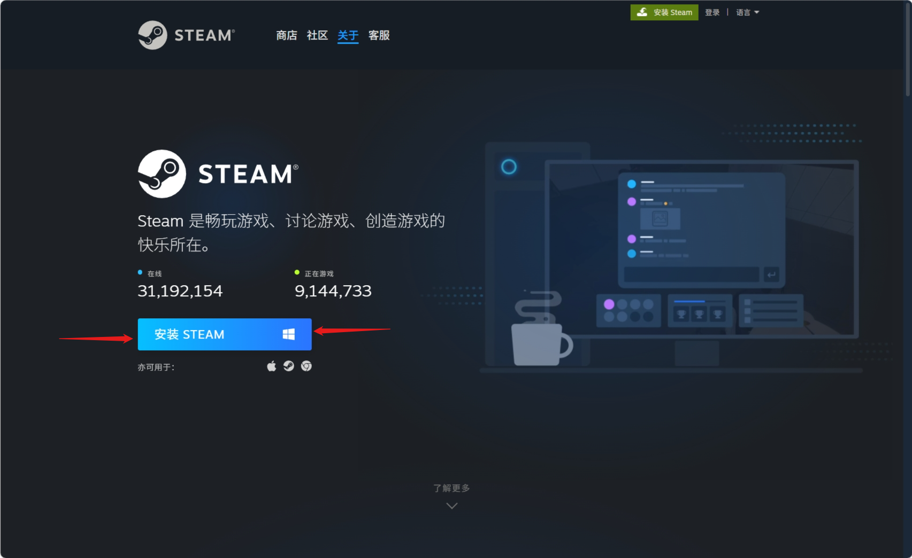
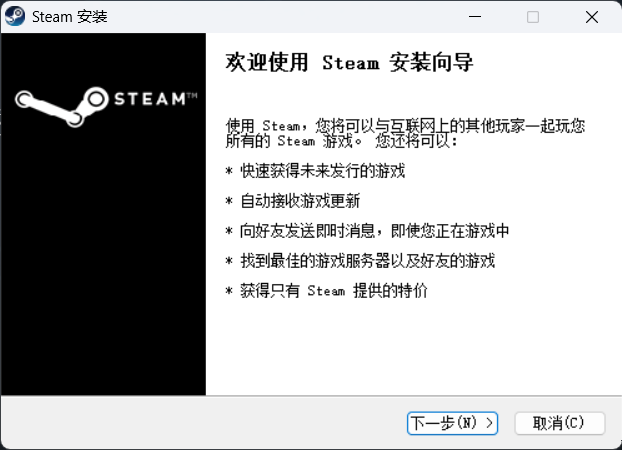
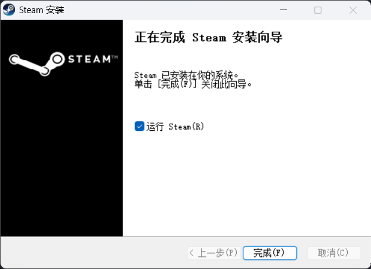
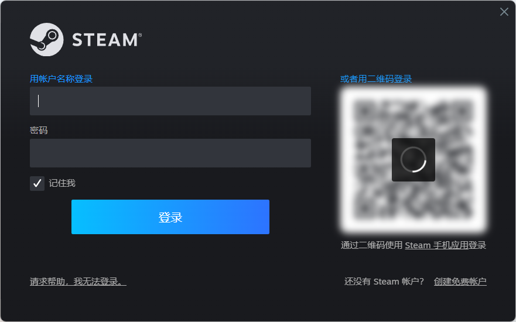

# **Steam** 上手指北

## 什么是 **Steam**

Steam 是 Valve 推出的电子游戏数字分发平台。Steam 集合了多种功能，如数字版权管理、游戏服务器匹配和反作弊系统，以及社交网络和游戏流媒体服务。Steam 还为用户提供自动更新游戏、游戏存档云存储，以及包括好友列表和游戏内聊天在内的社区功能。根据 CompareCamp2020 年统计，Steam 平台是全球最大的电脑游戏数字分发平台，占全球 50%-70%的电脑游戏下载量。 2003 年 9 月， Valve 将其作为一款软件客户端推出，提供自动更新游戏的功能，这一功能在 2005 年末扩展到了第三方游戏发行商发行的作品。

## 下载与安装 {#install}

使用搜索引擎搜索 Steam 并进入域名为 `https://store.steampowered.com/` 的网站

!!! danger "警告"

    请不要进入类似 **“Steam 管家”** 、 **Steam 助手** 之类的站点并认准官方域名

    请务必检查站点域名，它一般在浏览器窗口的上方。

> 注：商城页面所显示语言可能与您计算机的语言与所在地区有关，请以实际情况为准

点击右上角绿色的 **安装 Steam** 按钮以前往 Steam 安装程序下载页面

点击蓝色的 **安装 STEAM** 按钮以下载安装程序

你应该可以在下载器的下载记录中找到名为 `SteamSetup.exe` 的可执行文件，运行这个可执行文件并按照提示进行相应的设置。

当安装程序提示 `Steam 已安装在你的操作系统`时，点击完成便可退出安装程序并完成安装。

!!! danger "警告"

    请检查Steam的安装路径中是否带有中文。若有，请将其修改为不包含中文的路径。

    :fontawesome-solid-circle-xmark:{: .orangered } **错误**格式：`D:\软件\Steam\`

    :fontawesome-solid-circle-check:{: .limegreen } **正确**格式：`D:\Software\Steam\`

!!! tip "小知识"

    通常软件会安装在系统盘符的 `Program Files` 或 `Program Files (x86)` 中，你一般可以放心地相信安装程序的默认路径

## 运行并注册

安装完毕后，你可以在 **桌面** 或 **“开始”菜单** 中找到 Steam 的快捷方式，运行快捷方式即可启动 Steam。

!!! tip "小知识"

    若你点击完成前没有取消默认 **“运行 Steam”** 的复选框，安装程序会在关闭后自动打开 Steam。

运行后你可能要等待 Steam 进行更新。更新完毕后你就会进入 Steam 的登陆页面。

若你拥有 Steam 账户，你可以直接在其中登陆。（当然如果你有的话大概率也用不到这篇文章吧）。如果没有，你可以点击右下角 `创建免费账户` 来进入浏览器注册界面。
